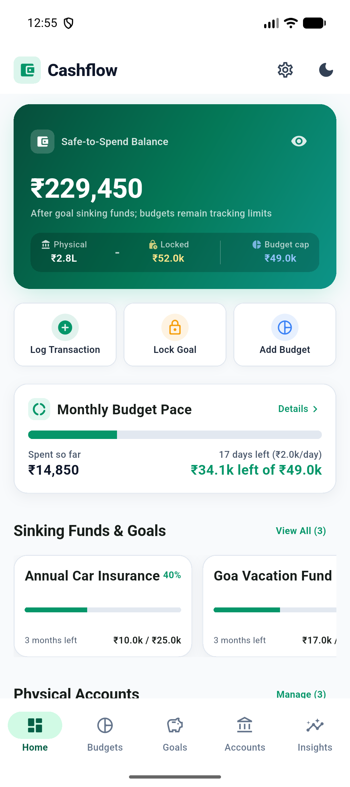
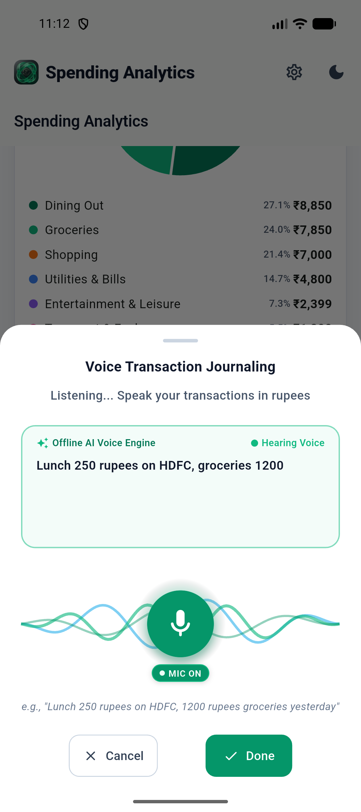
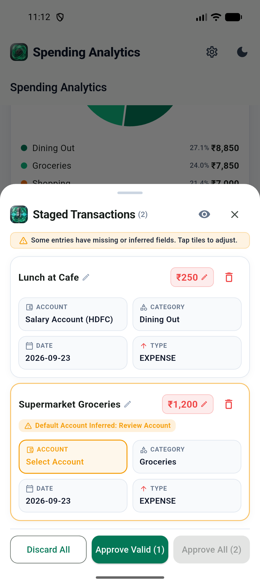
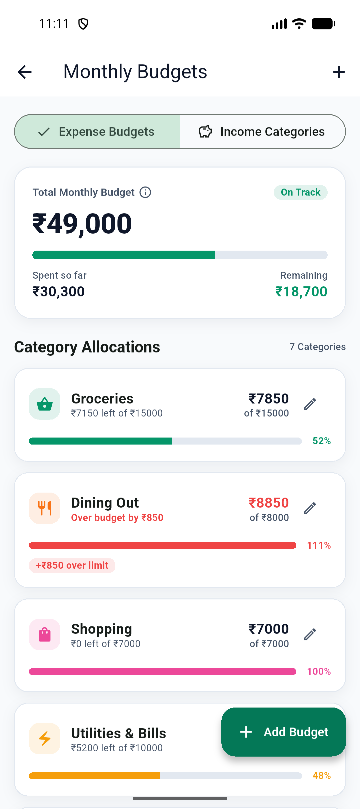
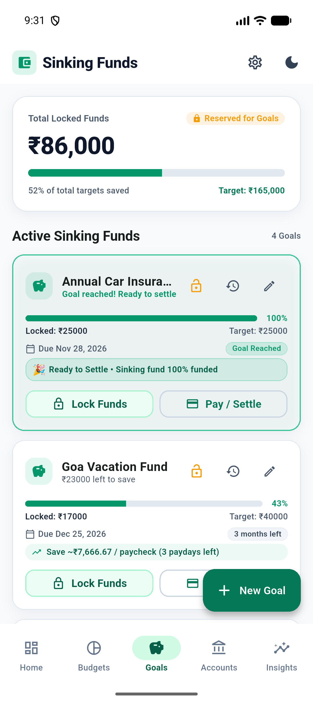
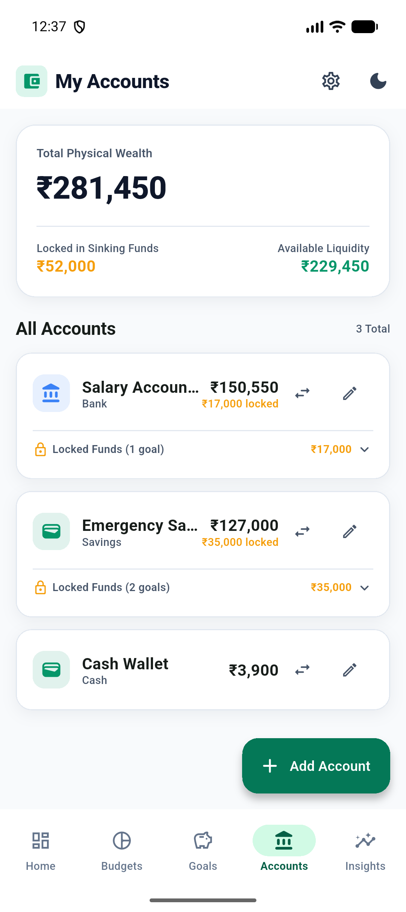
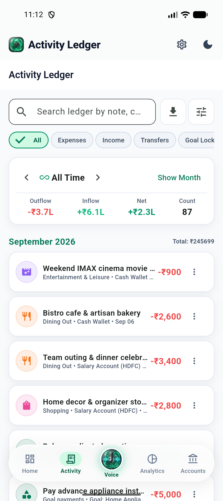
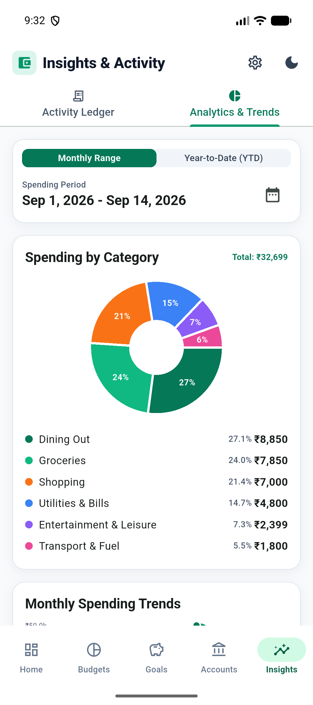
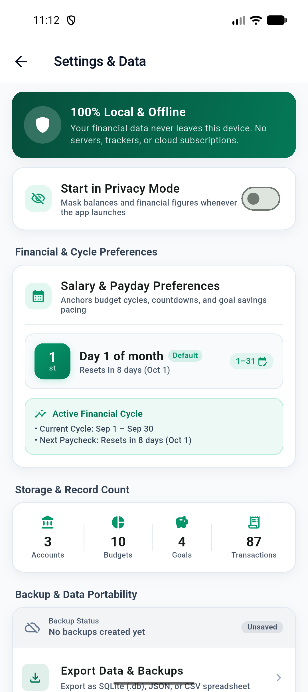

<p align="center">
  
</p>

# Cashflow

[](https://flutter.dev)
[](https://sqlite.org)
[](#private-by-default)
[](docs/user/VOICE_JOURNALING.md)
[](https://vyavahareyash.github.io/cashflow/)
[](LICENSE)
[](https://buymeacoffee.com/vyavahareyash)
[](https://github.com/sponsors/vyavahareyash)

Cashflow is a private, offline-first personal finance app built with Flutter. It solves the biggest problem with traditional budgeting apps by answering one practical question: **how much money can I actually spend right now without sabotaging my future goals?**

Track real balances across cash and bank accounts, align budgets with your actual payday schedule, and reserve money in virtual envelopes for sinking funds—with zero bank credentials, zero cloud accounts, and zero tracking.

> 🎙️ **Zero-Friction Voice AI Journaling**: Tired of tedious manual transaction forms? Cashflow is more than a manual logbook and safe-to-spend planning calculator. Speak your daily spending naturally in an unstructured monologue, let on-device AI extract structured transactions, review in seconds with interactive chips, and batch-approve to your ledger. **100% private with zero cloud backends, zero telemetry, and zero audio persistence.** [Explore Voice AI Journaling →](docs/user/VOICE_JOURNALING.md)

---

## Support Development

Cashflow is 100% free, private, and open-source with zero ads, zero trackers, and zero subscriptions. If Cashflow helps you manage your money, buying a coffee or sponsoring development is greatly appreciated!

<a href="https://buymeacoffee.com/vyavahareyash" target="_blank">
  
</a>

<br>

> 📊 **Explore Engineering & Contribution Stats**: Interested in development velocity, COCOMO II effort estimations, test coverage ratios, and architectural value breakdown? Check out the **[Interactive Project Timeline & Analytics Report →](https://vyavahareyash.github.io/cashflow/)**.

---

## Download for Android

[Download the latest APK: Cashflow](https://github.com/vyavahareyash/cashflow/releases/latest/download/cashflow-release.apk) · [View all release assets](https://github.com/vyavahareyash/cashflow/releases/latest)

> 🚀 **Be the first to try latest features & updates!**  
> Cashflow is currently in internal testing. Join the closed beta program on Google Play to test upcoming builds and new capabilities before anyone else.  
> 👉 **[Join Early Access & Beta Testing →](https://docs.google.com/forms/d/e/1FAIpQLSeS5t2W5TJENUD73Hy1zwWp6KLg0rB2z24ROziZVXlws4Af9Q/viewform?usp=dialog)**


<p align="center">
  
</p>

---

## The Safe-to-Spend Balance

Traditional apps confuse your physical bank balance with money you are actually free to spend. Cashflow separates money you hold from money that is already spoken for:

```text
Usable Balance = Total Account Money - Locked Goal Allocations
```

- **Total Physical Balance**: The real sum of money currently in your checking, savings, and cash accounts.
- **Locked Goal Allocations**: Virtual envelope reserves earmarked for specific savings targets (e.g. emergency fund, vacation, tax bill).
- **Monthly Budgets**: Flexible tracking targets for awareness. Expenses reduce your balance when they actually happen—preventing artificial double-counting of planned expenses.

---

## Key Features

- **Offline Voice AI Journaling**: Eliminate the #1 cause of budgeting friction—manual transaction logging. Tap the prominent microphone button and dictate multiple expenses, incomes, or transfers in continuous natural speech. Platform-native on-device speech recognition paired with a local neural model (SmolLM2) extracts amounts, accounts, categories, and relative dates with immediate audio deletion and zero cloud dependencies.
- **Safe-to-Spend Dashboard**: Instantly see your true disposable balance alongside total physical assets and active goal locks.
- **Privacy Mode**: Tap the eye icon to instantly mask all account balances, budgets, and transaction amounts (`$••••••`) when in public or recording screencasts.
- **Custom Payday Cycles**: Support for custom salary cycle start days (e.g., 25th to 24th). Budgets and burn pace automatically adjust to your actual earning schedule.
- **Daily Burn Pace Indicator**: Tracks your actual daily spending velocity against allowable daily budget to prevent mid-month budget exhaustion.
- **Sinking Funds & Virtual Envelopes**: Lock money from any account toward goals without opening multiple bank accounts. Enjoy celebratory confetti flair when goals are achieved!
- **Atomic Account Transfers**: Move funds between checking, savings, and cash with atomic dual-entry integrity that does not distort category expense reports.
- **Deep Analytics & Trends**: Interactive category breakdowns, spending velocity over time, and net cashflow indicators.
- **100% Offline & Private**: Zero external servers, zero analytics, zero bank logins. Local SQLite storage with full JSON and SQLite export/import backup tools.

---

## Explore the App

<table>
  <tr>
    <td></td>
    <td></td>
  </tr>
  <tr>
    <td align="center"><b>Zero-friction on-device voice dictation</b></td>
    <td align="center"><b>Multi-draft transaction staging & review</b></td>
  </tr>
  <tr>
    <td></td>
    <td></td>
  </tr>
  <tr>
    <td align="center"><b>Track spending by category & payday cycle</b></td>
    <td align="center"><b>Lock virtual funds for savings goals</b></td>
  </tr>
  <tr>
    <td></td>
    <td></td>
  </tr>
  <tr>
    <td align="center"><b>Manage cash & bank accounts with transfers</b></td>
    <td align="center"><b>Analyze transaction history & cashflow</b></td>
  </tr>
  <tr>
    <td></td>
    <td></td>
  </tr>
  <tr>
    <td align="center"><b>Review monthly trends & burn velocity</b></td>
    <td align="center"><b>Export & restore portable JSON / SQLite backups</b></td>
  </tr>
</table>

> 📸 **Visual Gallery**: Explore all 40+ light and dark screens, modal dialogs, and tablet layouts in the [Screenshot Gallery](screenshots/index.html).

---

## Documentation

Comprehensive guides and architectural specifications are available in the [`docs/`](docs/INDEX.md) directory:

- [User Feature Guide](docs/user/FEATURE_GUIDE.md) — Comprehensive user manual for every feature and workflow.
- [Offline Voice Journaling Guide](docs/user/VOICE_JOURNALING.md) — Frictionless on-device AI voice logging without forms or cloud backends.
- [Onboarding & FAQ](docs/user/FAQ_AND_ONBOARDING.md) — 3-step setup guide and answers to common questions.
- [System Architecture](docs/engineering/ARCHITECTURE.md) — Three-tier architecture, reactive state model, and SQLite schema ER diagram.
- [Calculations & Formulas](docs/engineering/CALCULATIONS.md) — Exact mathematical definitions for Usable Balance, Payday Cycles, and Daily Burn Pace.
- [Development Guide](docs/engineering/DEVELOPMENT.md) — Developer setup, command cheatsheet, emulator guide, and screenshot automation.
- [Architecture Decisions (ADRs)](docs/adr/) — Key technical tradeoffs and decisions.
- [Product Specification](docs/product/SPECIFICATION.md) — Feature specifications and rules.

---

## For Developers

Cashflow is built with Flutter and SQLite.

### Local Setup

```bash
# Clone the repository
git clone https://github.com/vyavahareyash/cashflow.git
cd cashflow

# Install Flutter dependencies
flutter pub get

# Run on connected device or emulator
flutter run
```

### Running Tests & Static Analysis

```bash
# Run unit and widget tests (single concurrency required for SQLite test file safety)
flutter test --concurrency=1

# Run static analysis
flutter analyze
```

---

## Private by Default

Cashflow does not require an account, has zero network dependencies, and makes zero network requests. Your financial data stays strictly on your local device.
