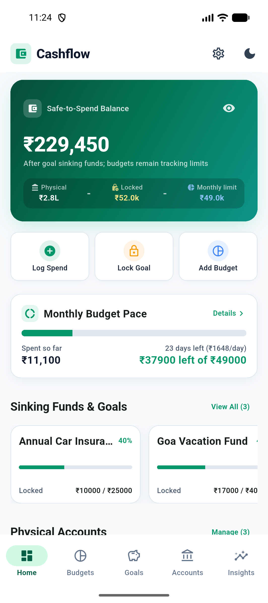
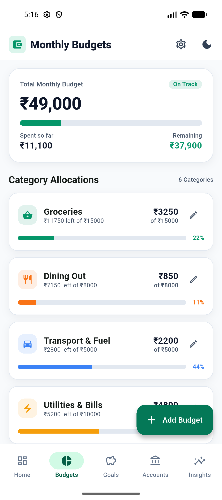
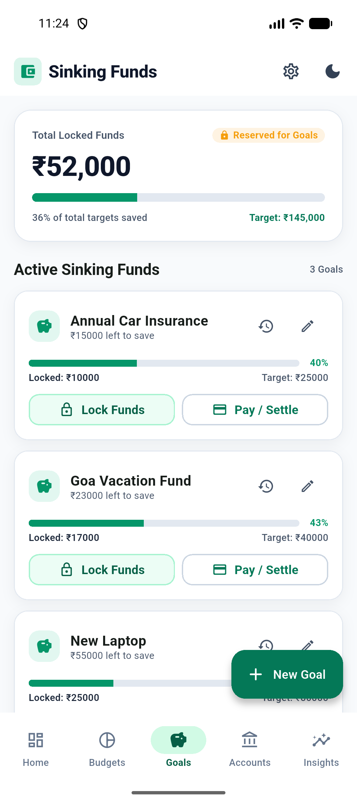
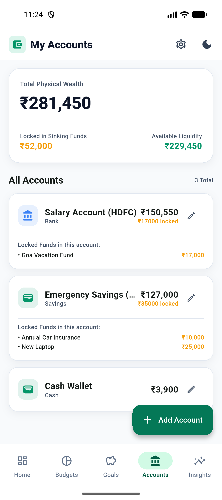
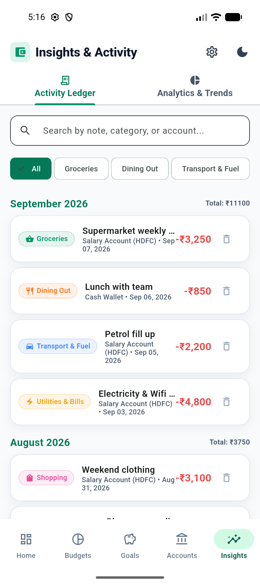
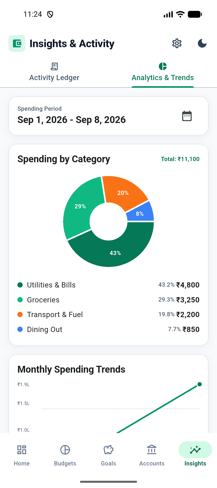
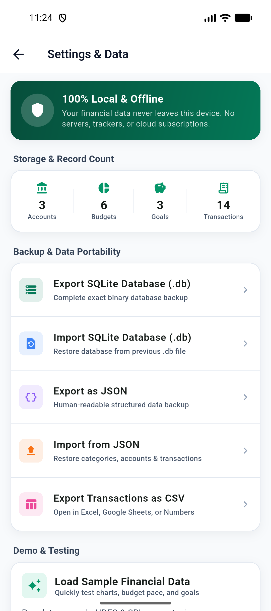

# Cashflow

Cashflow is a private, offline-first personal finance app that answers one practical question: **how much money can I actually spend right now?**

Track the money in your accounts, set monthly spending targets, and reserve money for future goals without needing a bank connection or an online account.

## Download for Android

[Download the latest APK: Cashflow v1.0.1](https://github.com/vyavahareyash/cashflow/releases/download/v1.0.1/app-release.apk) · [View all release assets](https://github.com/vyavahareyash/cashflow/releases/latest)



## See your usable balance

Cashflow separates money you have from money that is already spoken for:

```text
Usable balance = account money - goal locks - monthly budget reserves
```

The dashboard keeps those numbers visible together, so you can make spending decisions with the full picture. Budgets are designed for tracking and awareness: going over a target shows you what happened rather than blocking the transaction.

## What you can do

- Manage bank and cash accounts in one place.
- Organize spending with categories and optional monthly budgets.
- Record expenses and review your transaction history.
- Set savings goals and lock money toward future expenses while it stays in its original account.
- Review spending by category and follow trends over time.
- Keep your data on your device and use local backup and restore tools.

## Explore the app

<table>
	<tr>
		<td></td>
		<td></td>
	</tr>
	<tr>
		<td align="center">Track monthly spending by category</td>
		<td align="center">Plan future expenses with savings goals</td>
	</tr>
	<tr>
		<td></td>
		<td></td>
	</tr>
	<tr>
		<td align="center">See balances across your accounts</td>
		<td align="center">Understand where your money goes</td>
	</tr>
	<tr>
		<td></td>
		<td></td>
	</tr>
	<tr>
		<td align="center">Spot changes in spending over time</td>
		<td align="center">Back up and restore your local data</td>
	</tr>
</table>

## Private by default

Cashflow stores your information locally in SQLite and works without an internet connection. No account or server is required for the offline experience, and your data stays on your device unless you choose to back it up or export it.

The app is being built for Android, iOS, and Web.

## For developers

This is a Flutter project. To run it locally:

```bash
flutter pub get
flutter run
```

Run the test suite with:

```bash
flutter test
```
