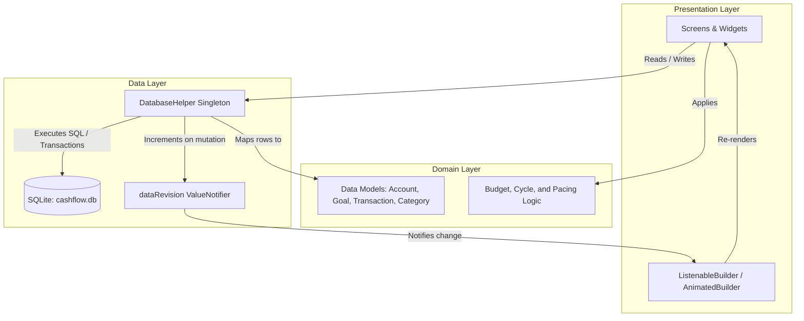
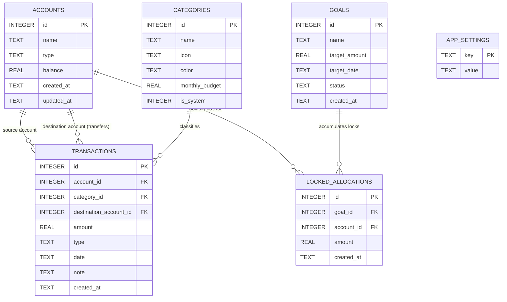

# Cashflow Architecture & System Design

Cashflow is a local-first, privacy-focused personal finance application built with Flutter and SQLite. This document details the architectural layers, reactive state patterns, database schema, and core invariants.

---

## High-Level Architecture

Cashflow follows a clean, three-tier local architecture:



### 1. Presentation Layer (`lib/screens/`, `lib/widgets/`)
- Flutter widgets organized by feature (Dashboard, Budgets, Goals, Accounts, Analytics, Settings).
- Reactive binding via `ListenableBuilder` or `AnimatedBuilder` listening to `DatabaseHelper.dataRevision`.
- Formatting utilities (`formatCurrency`, `formatDate`) handle currency masking when Privacy Mode is active.

### 2. Domain & Model Layer (`lib/models/`)
- Immutable Dart model classes representing system entities:
  - `Account`: Bank or cash repository with running balance.
  - `Category`: Spending group with icon, color, and optional monthly spending budget.
  - `TransactionItem`: Financial event (Expense, Income, or Account Transfer).
  - `Goal`: Savings target with deadline and status (active, completed, archived).
  - `LockedAllocation`: Virtual envelope lock binding account funds to a goal.
  - `AppSettings`: Key-value store for user preferences (payday cycle start day, privacy mode, theme).

### 3. Data & Storage Layer (`lib/database/`)
- `DatabaseHelper`: Central database manager with atomic SQLite operations.
- Platform support:
  - Mobile (Android / iOS): Native `sqflite` plugin.
  - Desktop / Tests (macOS / Linux / Windows / Unit Tests): `sqflite_common_ffi` with databaseFactory initialization.

---

## Reactive State Management (`dataRevision`)

Cashflow avoids heavy external state containers in favor of a lean, reliable event notifier:

```dart
class DatabaseHelper {
  // Global mutation notifier
  static final ValueNotifier<int> dataRevision = ValueNotifier<int>(0);

  static void notifyDataChanged() {
    dataRevision.value++;
  }
}
```

### How Mutation Flows
1. User creates an expense or locks funds.
2. `DatabaseHelper` wraps operations in an atomic SQLite `db.transaction(...)`.
3. Upon commit, `DatabaseHelper.notifyDataChanged()` increments `dataRevision`.
4. Any active screen listening to `DatabaseHelper.dataRevision` triggers a fresh asynchronous query.
5. All visible totals, cards, and charts refresh simultaneously with zero stale cache bugs.

---

## Database Schema & Entity Relationships

The local SQLite database schema is defined as follows:



### Table Definitions & Foreign Key Rules

| Table | Primary Key | Foreign Keys | On Delete Behavior |
| :--- | :--- | :--- | :--- |
| `accounts` | `id AUTOINCREMENT` | None | Restricted if linked to transactions or active locked allocations |
| `categories` | `id AUTOINCREMENT` | None | Default fallback category reassignment on delete |
| `transactions` | `id AUTOINCREMENT` | `account_id` $\to$ `accounts.id`<br>`destination_account_id` $\to$ `accounts.id`<br>`category_id` $\to$ `categories.id` | Cascades or handles balance reversal atomically |
| `goals` | `id AUTOINCREMENT` | None | `CASCADE` deletes `locked_allocations` |
| `locked_allocations`| `id AUTOINCREMENT` | `goal_id` $\to$ `goals.id`<br>`account_id` $\to$ `accounts.id` | `CASCADE` on goal deletion |
| `app_settings` | `key` | None | Simple key-value store |

---

## Core Invariants & Business Logic

### 1. Safe-to-Spend Usable Balance
Usable balance reflects cash that is not committed to any goal.
$$\\text{Usable Balance} = \\sum \\text{Physical Accounts Balance} - \\sum \\text{Active Locked Allocations}$$

### 2. Atomic Balance Updates
Transaction mutations must be executed inside database transactions:
- **Expense**: Deducts `amount` from `accounts.balance` where `id = account_id`.
- **Income**: Adds `amount` to `accounts.balance` where `id = account_id`.
- **Account Transfer**: Simultaneously deducts from source account and credits destination account within the same SQLite transaction.
- **Transaction Deletion**: Performs exact mathematical reversal on affected accounts before deleting the row.

### 3. Virtual Envelopes (No Inter-Bank Movement)
- Locking funds toward a goal inserts a row in `locked_allocations`.
- The physical account balance in `accounts` is unaffected.
- The total locked for that goal increments, and usable balance decrements.
- Allocating more than the account's physical balance or more than the goal's remaining target is rejected.

---

## Offline Guarantees & Backup Integrity

- **Zero Cloud Dependencies**: The app operates with zero network permission requirements in `AndroidManifest.xml` / `Info.plist`.
- **Atomic Import/Export**:
  - Export produces JSON or raw SQLite file.
  - Import validates schema version and required entity tables before transaction commit.
  - Restoring a backup replaces the SQLite store within a single rollback-safe operation.
